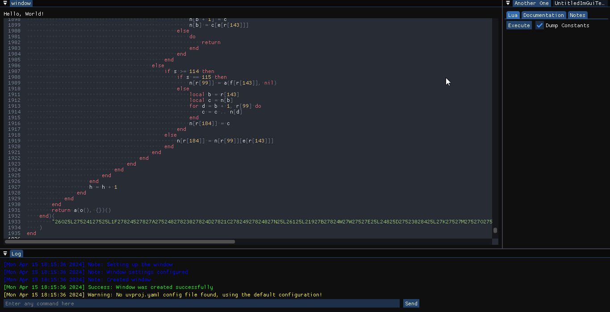

# Lua Debugger
Lua Debugger is an attempt at writing a Luau instrumentation toolkit , that reversers can use to deobsfucate and analyze malicious Luau code.

It's still a work in a progress and lacks a lot of features , but hey you gotta start somwhere :)

Note : I think that for now this project is windows only , since stuff like Dump Constants relies on hooking code that is specific to MSVC, maybe one day i will port it to linux ?
# Images

# Features
- Run Lua Code is a fully sandboxed environnement separated from your computer
- Technical Documentation of the various custom functions available in the environnement
- A notes tab where you can take note of anything that you see in the script and you want to remember

# Random Ideas I have
- Find a way to snapshot lua_State* to analyze it (maybe make a full copy when script is finished ?)

# TODO :
- [ ] Add a way to save/read the code to a file
- [ ] Add Documentation
- [ ] Log all actions happening
- [ ] Place hooks on lua C functions on the fly and inspect their values
- [ ] Add a bytecode viewer
# Technologies used
- ## [luau](https://github.com/luau-lang/luau)
- ## [UntitledImGuiFramework](https://github.com/MadLadSquad/UntitledImGuiFramework)
- ## [RCMP](https://github.com/Smertig/rcmp)
- ## [ImGuiColorTextEdit](https://github.com/ElCapor/ImGuiColorTextEdit)

# How to build ?
## Video Tutorial (Recommended) : Coming soon
## Getting the dependencies :
## Make sure to have [cmake](https://cmake.org) installed
Download UntitledImGuiFramework through git :

```sh
git clone https://github.com/MadLadSquad/UntitledImGuiFramework.git --recursive
```

Then go into your directory and run `./install.sh` with git bash, this will setup the base framework.

Then copy this repo into UntitledImGuiFramework/Projects and then cd into it and run `submodule update --init --remote --merge --recursive`, when you're done go follow the steps in [Project Generation](#project-generation)

### Project generation :
Windows only for now.

Run `generate.bat` and then you can build the project normally just like any other cmake project.


# Credits

[@ElCapor](https://github.com/ElCapor) - Main Developer

[@Ficello](https://github.com/Ficelloo) - Gave me the idea of deobsfucating Luau code for fun

[@Madman10k](https://github.com/Madman10K) - The creator of [UntitledImGuiFramework](https://github.com/MadLadSquad/UntitledImGuiFramework) , who kindly spend over 4 hours helping me with the project generation and setup, and still continues to help me