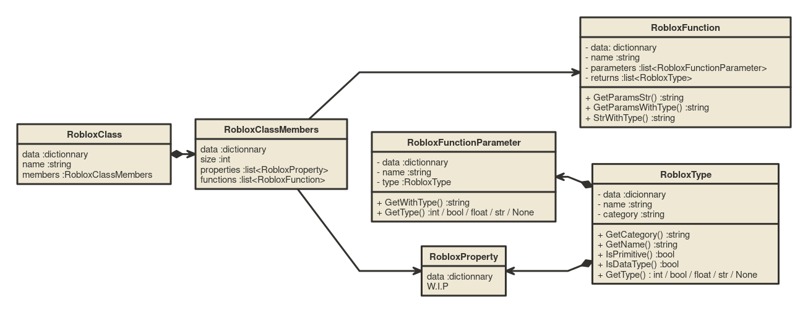

# Back to main [Readme](../../Readme.md)
# Attempt at emulating roblox environnement with python & TableInstruction
The python code is responsible for parsing lua api dump and generating a dummy lua environnement that will be executed before each script.

You might want to use this in your own toolkits , so here is a documentation
# Documentation

